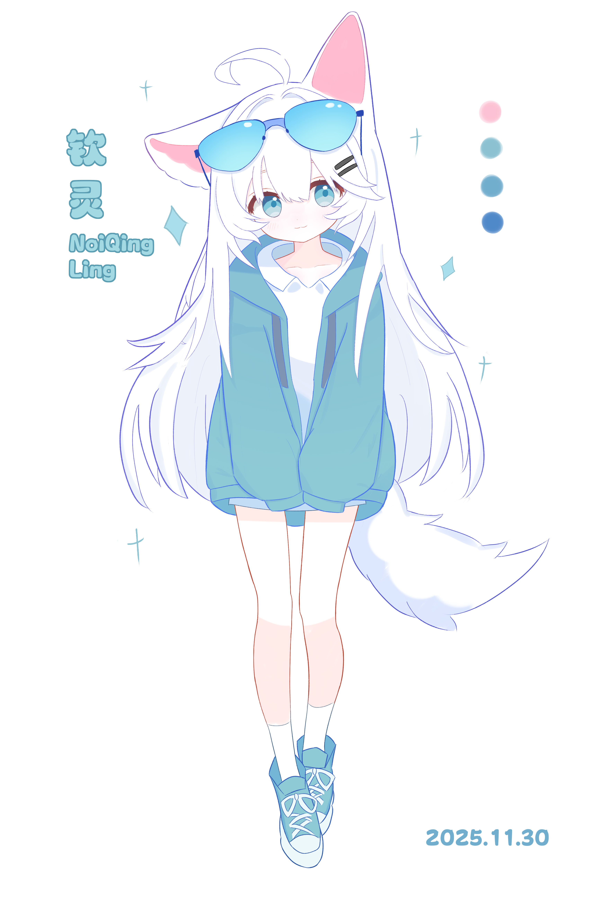
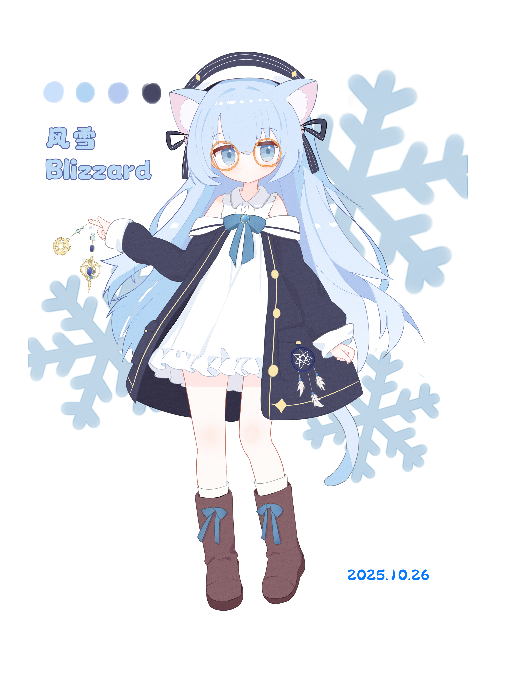
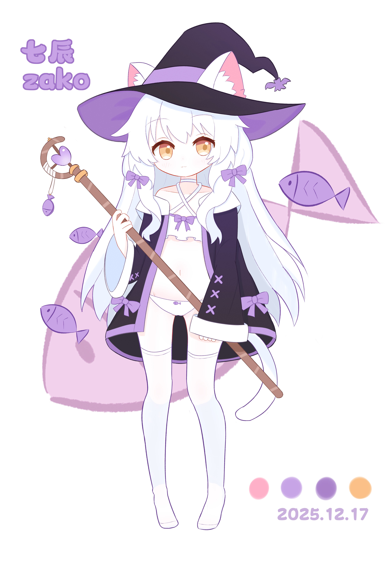
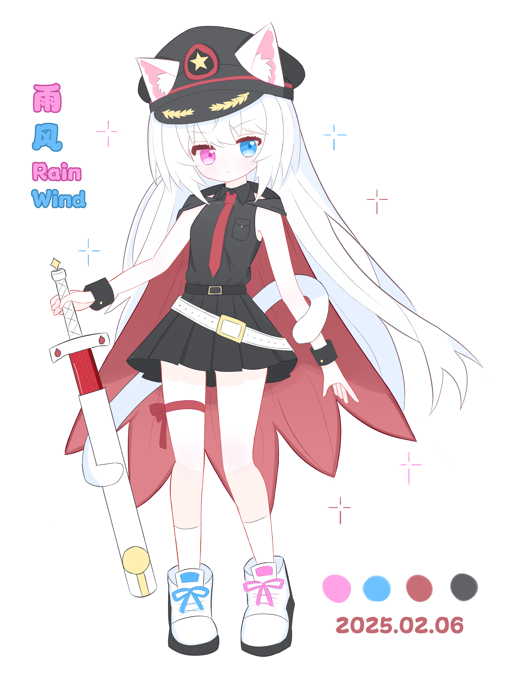

# 我的个人绘画技巧尝试与笔记

## 一、立绘绘制

### 1. 钦灵立绘：2025.11 绘制

#### i. 基础信息

钦灵的头像其实之前就画出来啦，现在为了在 LingChat 更好看一点，于是画了全身立绘。所以并不是一张从0开始的。这张也算是修改了10几天慢慢完善的吧。

#### ii. 学习到的经验

- **线稿**：这次绘制的线稿，特意使用了炭笔，并且在外轮廓进行了极大的加粗。画布大小大概是3k\*5k，而笔画的大小也比较粗，大约在3px, 6px, 12px左右。这种炭笔+粗笔画会让线条看上去效果非常不错，也是我自己非常满意的一幅画。在这次也尝试在眼睛上加了一点小细节，不过看上去还是非常的简单单纯。
- **上色**：整体阴影都采用了冷色调，在上色上也非常淡，很符合这种冷色系白毛人物。不过确实这次阴影绘制的比较简单呢。

#### iii. 感觉不足的地方

说实在，钦灵这张除了衣服褶皱细节不是太多，其他地方都挺满意的。毕竟这个真的改了很久，很难不满意。

### 2. 风雪立绘：2025.10 绘制

#### i. 基础信息

风雪的立绘算是我第一次尝试不使用Q版绘画，以及真正的开始设计一个人物。这张画耗时也非常久大约在10天。

#### ii. 学习到的经验

- **设计**：这次的设计从最简单的蝴蝶结，开始从人物的性格出发去确定整体的形象，表情，还有服饰。由于设计的人物是天文学，魔法相关，所以设计了魔法师的服装和星星和行星一样的花纹。

#### iii. 感觉不足的地方

主要是感觉动作太僵硬，没有很好的人体动态效果，虽然反反复复改了很多次，不过还是不尽人意。

### 3. 七辰立绘：2025.11 绘制

#### i. 基础信息

七辰虽然说是直接从风雪那跑的图，也是我第一次接受委托的绘画。这次在人物上大胆的采用了比较色气的设计。最后看起来效果其实还不错。

#### ii. 学习到的经验

- **色气**：适当增加角色暴露，确实可以无脑的提升画面的观赏度。
- **第二草稿**：如果第一草稿不满意的话，可以在那个基础上继续画第二草稿呢。这样最后整体的设计和造型会更满足自己的需求。
- **色腿**：腿部反复修改了很多次，主要是要小腿细腻，体现出美少女的那种腿感，而不是大粗萝卜，线条的变化很重要。

#### iii. 感觉不足的地方

这次主要是感觉脸部细节太少，导致看上去脸有点呆。

### 4. 雨风立绘：2025.12 绘制

#### i. 基础信息

第二张受委托的稿子，最痛苦的一集，画了10多天改了两次线稿最后仍然画的一坨。黑色系衣服对我这种白毛画师还是太有杀伤力了，很多时候根本不知道怎么落笔。

#### ii. 学习到的经验

- **无**：本次有点过于自信了，采用之前的画法去画一个红色，黑色主色调的角色，导致看上去非常违和。而且红蓝配色的眼睛让我不知道如何设计角色，让我画的非常痛苦。

#### iii. 感觉不足的地方

整体看上去非常不美观，我感觉哪里都不足，所以在这个画之后，我开始大量学习斋藤直葵的画法，开始重新审视自己的绘画方式。这个画我迟早重画重新设计一遍。

### 5. 小猫立绘：2026.01 绘制

#### i. 基础信息

第三张受委托的稿子，这次是耗时最短，大约三天就完成的立绘。整体上直接选择参考了自己喜欢的画师的眼睛画法和纸张大小，笔画大小，使用了最简单的铅笔画。相比于上一张，这次明显变的更加精细，画面整体也非常和谐。

#### ii. 学习到的经验

- **细腻**：线稿一定不要太粗，不然整体看上去会非常丢失细节和信息量。在斋藤直葵的指导中，画面的信息量是非常重要的，所以一定要保证画的细节，画的“不偷懒”。
- **参考**：画画参考是非常重要的，无论是参考画师还是参考实物，我发现这样画画的速度会非常快，而且效果也会非常好，相比于反反复复去想象一个没见过的东西。

#### iii. 感觉不足的地方

这次主要感觉是眼睛太大了，导致看起来似乎有点Q版了，属于是老毛病犯了，好在下一张马上就纠正了。

### 6. 酒狐立绘：2026.02 绘制

#### i. 基础信息

花了大约四天，第一次尝试画二创的人物，主要参考了[画不好线稿的5个原因](https://www.bilibili.com/video/BV11e4y1p7MS)的绘画方法，不得不说确实非常有帮助。相比于上一张，这一张画更大胆的使用了更粗的笔，并且采用了更加丰富的暖色调色彩。基础笔大小为6px，3px，画布大小大约为6k\*9k。

#### ii. 学习到的经验

- **冷暖色调**：对于冷色调，比如钦灵立绘那种，更适合用偏冷色的阴影色彩和更淡的上色方式。而暖色调则相反，更适合用偏暖色的阴影色彩和更具有对比度，更大胆的上色方式。
- **增加信息量**：本次绘制在脚部，衣服，褶皱上增加了细节，让画面看上去更加的丰富，我觉得是一次很好的尝试。
- **草稿预览**：可以使用“第二草稿”+“粉系阴影”，提前预览一下整体的效果，方便提前修改，保证最后质量不会崩溃。

#### iii. 感觉不足的地方

长发的阴影处理上我还是感觉不太好，而且人物整体会感觉有点窄，后面花了很大的劲变胖才缓解。线稿还是感觉有点细，没有钦灵那种可爱的线条的感觉，很大原因也可能是线稿太干净了。
